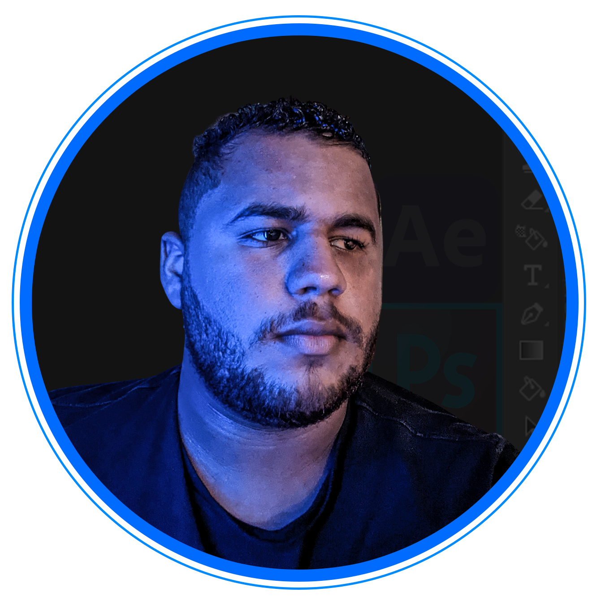

# portfolio
 # portfolio desenvolvido em HTML e CSS

<!DOCTYPE html>
<html lang="pt-BR">
<head>
    <meta charset="UTF-8">
    <meta name="viewport" content="width=device-width, initial-scale=1.0">
    <title>Gui Designer | Mkt Online</title>
    <link rel="stylesheet" href="estilos/style.css">
</head>
<body>
    <header class="cabecalho">
        <nav class="cabecalho-menu">
            <a class="cabecalho-link" href="index.html">Home</a>
            <a class="cabecalho-link" href="about.html">Sobre Mim</a>
        </nav>
    </header> 
    <main class="apresentacao">
        <section class="apresentacao__conteudo">
            <h1 class="apresentacao__conteudo_titulo">Olá, me chamo Guilherme Lima. Sou designer gráfico <strong class="titulo-destaque">e estudante FrontEnd!</strong></h1>
            
Conheça as diversas artes que já criei e meus projetos FrontEnd!

            

                <h2 class="apresentacao__links_subtitulo">Acesse minhas redes:</h2>
                <a class="apresentacao__links_link" href="https://www.instagram.com/guidesignergrafico_/">
                        

                            
                            Instagram
                        

                    </a>
                <a class="apresentacao__links_link" href="https://www.github.com">
                    

                        
                        GitHub
</a>
            

        </section>
        
    </main>
    <footer class="rodape">Desenvolvido por Gui Designer | Mkt 2024</footer>
</body>
</html>
